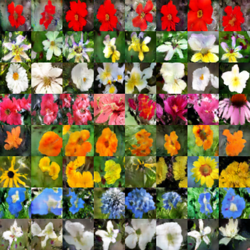

# Text To Image Synthesis 


This is a tensorflow implementation of synthesizing images. The images are synthesized using the GAN-CLS Algorithm from the paper [Generative Adversarial Text-to-Image Synthesis][2]. This implementation is built on top of the excellent [DCGAN in Tensorflow][3].

Plese star https://github.com/tensorlayer/tensorlayer


Image Source : [Generative Adversarial Text-to-Image Synthesis][2] Paper

## Requirements
- [TensorFlow][4] 1.0+
- [TensorLayer](https://github.com/zsdonghao/tensorlayer) 1.4+
- [NLTK][8] : for tokenizer

## Datasets
- The model is currently trained on the [flowers dataset][9]. Download the images from [here][9] and save them in ```102flowers/102flowers/*.jpg```. Also download the captions from [this link][10]. Extract the archive, copy the ```text_c10``` folder and paste it in ```102flowers/text_c10/class_*```.  

**N.B**  You can downloads all data files needed manually or simply run the downloads.py and put the correct files to the right directories.
```python 
python downloads.py
```

## Codes
- `downloads.py` download Oxford-102 flower dataset and caption files(run this first).
- `data_loader.py` load data for further processing.
- `train_txt2im.py` train a text to image model.
- `utils.py` helper functions.
- `model.py` models.

## References
- [Generative Adversarial Text-to-Image Synthesis][2] Paper
- [Generative Adversarial Text-to-Image Synthesis][11] Torch Code
- [Skip Thought Vectors][1] Paper
- [Skip Thought Vectors][12] Code
- [Generative Adversarial Text-to-Image Synthesis with Skip Thought Vectors](https://github.com/paarthneekhara/text-to-image) TensorFlow code
- [DCGAN in Tensorflow][3]

## Results

- the flower shown has yellow anther red pistil and bright red petals.
- this flower has petals that are yellow, white and purple and has dark lines
- the petals on this flower are white with a yellow center
- this flower has a lot of small round pink petals.
- this flower is orange in color, and has petals that are ruffled and rounded.
- the flower has yellow petals and the center of it is brown
- this flower has petals that are blue and white.
- these white flowers have petals that start off white in color and end in a white towards the tips.

<a href="http://tensorlayer.readthedocs.io">
<div align="center">
	
</div>
</a>


## License
Apache 2.0


[1]:http://arxiv.org/abs/1506.06726
[2]:http://arxiv.org/abs/1605.05396
[3]:https://github.com/zsdonghao/dcgan
[4]:https://github.com/tensorflow/tensorflow
[5]:http://www.h5py.org/
[6]:https://github.com/Theano/Theano
[7]:http://scikit-learn.org/stable/index.html
[8]:http://www.nltk.org/
[9]:http://www.robots.ox.ac.uk/~vgg/data/flowers/102/
[10]:https://drive.google.com/file/d/0B0ywwgffWnLLcms2WWJQRFNSWXM/view
[11]:https://github.com/reedscot/icml2016
[12]:https://github.com/ryankiros/skip-thoughts
[13]:https://github.com/ryankiros/skip-thoughts#getting-started
[14]:https://bitbucket.org/paarth_neekhara/texttomimagemodel/raw/74a4bbaeee26fe31e148a54c4f495694680e2c31/latest_model_flowers_temp.ckpt
